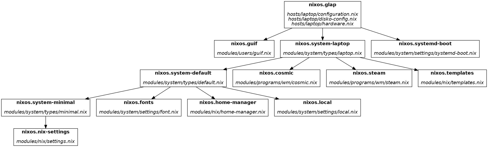

# Flake-Parts-Graph (fpg)

## Why This Tool Exists

I recently switched to the [dendritic design pattern with flake parts](https://github.com/Doc-Steve/dendritic-design-with-flake-parts) and needed a way to understand my module structure:

- **Which modules get imported from which other modules?**
- **Which modules get declared in which files?**

Manually tracing these relationships through code was tedious and error-prone, so I built this tool to visualize the module dependency graph.

## How It Works

This tool leverages the new `.graph` output introduced in the Nixpkgs module system.
Thanks to [this merged PR](https://github.com/NixOS/nixpkgs/pull/403839), we can now obtain a JSON representing the tree of modules that took part in the evaluation of a configuration.

For more details, see the [announcement on NixOS Discourse](https://discourse.nixos.org/t/nixpkgs-module-system-config-modules-graph/67722).

> [!NOTE]
> It works by searching for [flake.modules](https://flake.parts/options/flake-parts.html#opt-flake.modules) in the input graph and will therefore only visualize these.
> Support for plain nixos modules is planed, though.


## Usage
### Obtaining the input graph:  
`nix eval --json '.#nixosConfigurations.<your-config>.graph' > graph.json`

### Generate a simplified JSON output:  
`fpg.py --input graph.json`  
or  
`nix run github:giomf/flake-parts-graph -- --input graph.json`

### Generate a Graphviz output:  
`fpg.py --input graph.json --graphviz`  
or  
`nix run github:giomf/flake-parts-graph -- --input graph.json --graphviz`

## Result

### JSON
```json
{
  "nixos.glap": {
    "imports": [
      "nixos.guif",
      "nixos.system-laptop",
      "nixos.systemd-boot"
    ],
    "files": [
      "hosts/laptop/configuration.nix",
      "hosts/laptop/disko-config.nix",
      "hosts/laptop/hardware.nix"
    ]
  },
  "nixos.guif": {
    "imports": [],
    "files": [
      "modules/users/guif.nix"
    ]
  },
  "nixos.system-laptop": {
    "imports": [
      "nixos.system-default",
      "nixos.cosmic",
      "nixos.steam",
      "nixos.templates"
    ],
    "files": [
      "modules/system/types/laptop.nix"
    ]
  },
  "nixos.system-default": {
    "imports": [
      "nixos.system-minimal",
      "nixos.fonts",
      "nixos.home-manager",
      "nixos.local"
    ],
    "files": [
      "modules/system/types/default.nix"
    ]
  },
  "nixos.system-minimal": {
    "imports": [
      "nixos.nix-settings"
    ],
    "files": [
      "modules/system/types/minimal.nix"
    ]
  },
  "nixos.nix-settings": {
    "imports": [],
    "files": [
      "modules/nix/settings.nix"
    ]
  },
  "nixos.fonts": {
    "imports": [],
    "files": [
      "modules/system/settings/font.nix"
    ]
  },
  "nixos.home-manager": {
    "imports": [],
    "files": [
      "modules/nix/home-manager.nix"
    ]
  },
  "nixos.local": {
    "imports": [],
    "files": [
      "modules/system/settings/local.nix"
    ]
  },
  "nixos.cosmic": {
    "imports": [],
    "files": [
      "modules/programs/wm/cosmic.nix"
    ]
  },
  "nixos.steam": {
    "imports": [],
    "files": [
      "modules/programs/wm/steam.nix"
    ]
  },
  "nixos.templates": {
    "imports": [],
    "files": [
      "modules/nix/templates.nix"
    ]
  },
  "nixos.systemd-boot": {
    "imports": [],
    "files": [
      "modules/system/settings/systemd-boot.nix"
    ]
  }
}
```

### Graphviz



## Disclaimer
This Readme and some minor parts of the project was created with the help of AI.
