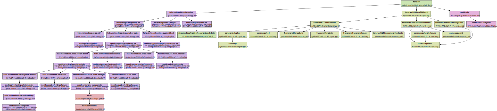

# Flake-Parts-Graph (fpg)

## Why This Tool Exists

I recently switched to the [dendritic design pattern with flake parts](https://github.com/Doc-Steve/dendritic-design-with-flake-parts) and needed a way to understand my module structure:

- **Which modules get imported from other modules?**
- **Which modules get declared in what files?**

Manually tracing these relationships through code was tedious and error-prone, so I built this tool to visualize the module dependency graph.

## How It Works

This tool leverages the new `.graph` output introduced in the Nixpkgs module system.
Thanks to [this merged PR](https://github.com/NixOS/nixpkgs/pull/403839), we can now obtain a JSON representing the tree of modules that took part in the evaluation of a configuration.

For more details, see the [announcement on NixOS Discourse](https://discourse.nixos.org/t/nixpkgs-module-system-config-modules-graph/67722).

## Usage

> [!TIP]  
> You can also use `nix run github:giomf/flake-parts-graph` instead of cloning this repository and executing `fpg.py`

### Obtaining the input graph:  
`nix eval --json '.#nixosConfigurations.<your-config>.graph' > graph.json`

### Read the input graph:
`fpg.py --input graph.json`  

### Output format:
#### JSON  
`fpg.py --input graph.json --format json`  

#### Graphviz: 
`fpg.py --input graph.json --format graphviz`  

## Result

## Disclaimer
This project uses AI as an aid.
